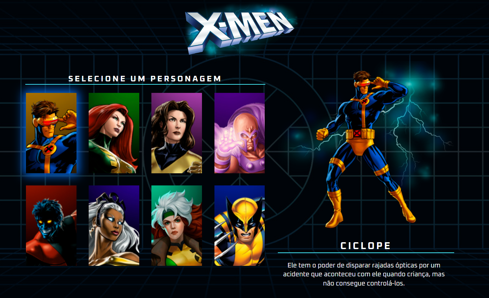

# Projeto X-Men

## 📖 Introdução 

Este é um projeto de estudo desenvolvido durante apresentado no canal [Dev em Dobro](https://www.youtube.com/c/devemdobro) criando uma tela de seleção de personagens de X-Men utilizando utilizando HTML, CSS e Javascript.

## 🔗Link de Acesso
- Deploy: 

## 👥Equipe
| [<br><sub>Daniel Emidio</sub>](https://github.com/DanielEmidio1988) |
| :---: |

## 🧭Status do Projeto
- ⏳Concluído

## 📄Concepção do Projeto

### Layout

| <br><sub>Home Page</sub> | 
| :---: |

### Funcionalidades
```bash
- Ao passar o mouse sobre um personagem, será destacado as principais informações como: Imagem Completa, Nome e Descrição do personagem;
```

## 💡Programas utilizados:
- VSCode

## 💻Tecnologias 


## 📫 Contato

E-mail: emidio.daniel@hotmail.com